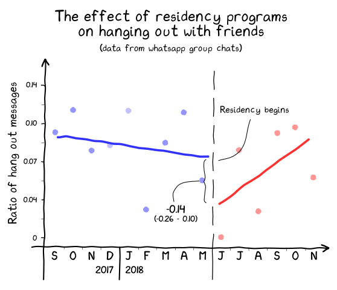

## All my friends are residents: Finding the effect that residency programs have on hanging out with friends.

### Summary
Although the negative effect that residency programs have on finding time to hang out with your homies is well known, only anecdotal evidence can be found in the literature. We aim to estimate that negative effect by measuring changes in the total number of whatsapp messages asking to hang out during the periods before and after the majority of the members in said group started a residency program.

### Design
We performed an interrupted time series analysis to estimate the impact that starting a residency programs had on the total number of messages asking to hang out offsetted by the total number of messages. Each data point represents a two week period.

A message asking to hang out was defined as any message containing one of the keywords specified in `analysis.ipynb`.

### Conclusions

Starting a residency program reduced the number of messages asking to hang out by almost 85% (IRR 0.14 | 95%CI 0.10 - 0.20) together with a sharp increase in friends' unhappiness.

#### Shortcomings
- While possible, no effective control group was used in the design of this study, this may be due do to the author's lack of friends outside the medical sphere.

